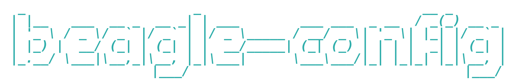
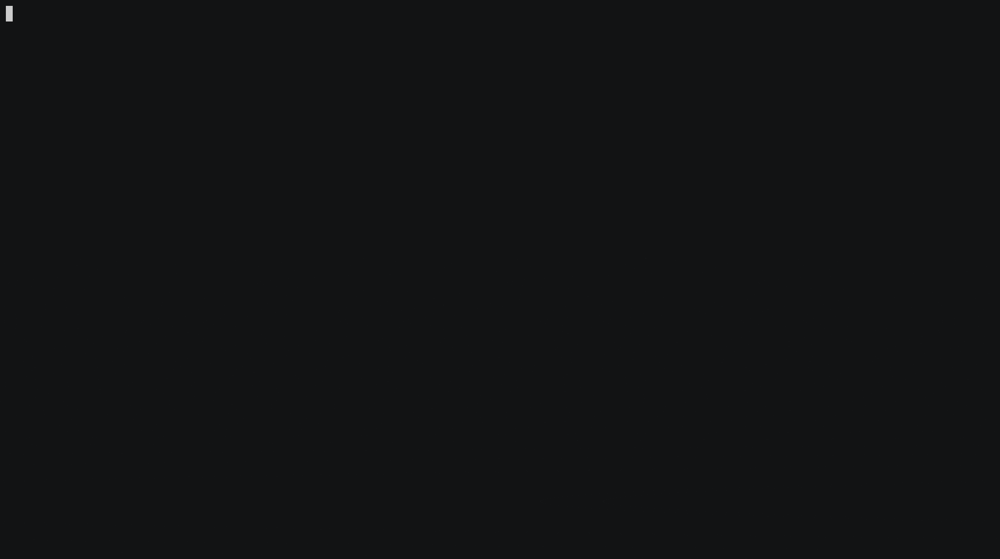

<br />
<p align="center">
  <a href="https://github.com/SAtacker/bb-config">
    
  </a>
  <p align="center">
    Configure your beagle devices easily.
    <br/>
    <br/>
    <a href="https://github.com/SAtacker/bb-config/wiki"><strong>Explore the docs »</strong></a>
    <br />
    <a href="https://github.com/SAtacker/bb-config/issues">Report Bug</a>
    ·
    <a href="https://github.com/SAtacker/bb-config/wiki/Examples">Examples</a>
    .
    <a href="https://github.com/SAtacker/bb-config/issues">Request Feature</a>
    ·
    <a href="https://github.com/SAtacker/bb-config/pulls">Send a Pull Request</a>
  </p>
</p>

<p align="center">
  
  
  
  
  
  
  
</p>

## Build

```bash
mkdir -p build && cd build
cmake ..
make -j$(nproc)
```
### Looks like


* Note: For Cross Compiling a script `cross_compile.sh` should work fine on debian based distros.
